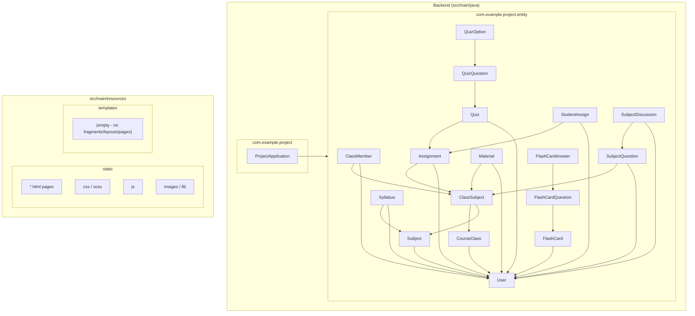
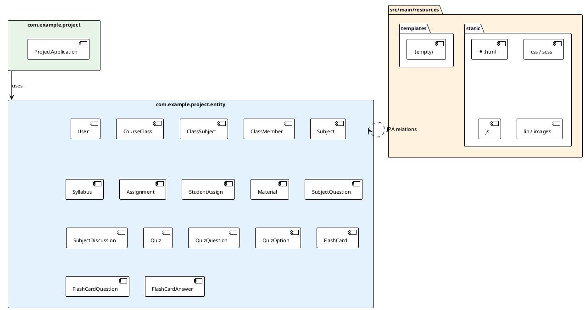

# Báo cáo Package Diagram & Mapping – Hệ thống HDUES

**Dự án:** HDUES (Hệ thống học trực tuyến Đại học Hải Dương)  
**Nền tảng:** Java Spring Boot (Backend), Thymeleaf (Front-end)  
**Mục đích tài liệu:** Chuyển tiếp cho AI khác – phân tích cấu trúc package, đối chiếu với tài liệu Report 3/4, đánh giá mức độ hoàn thiện.

---

## 1. Kết quả quét source code

### 1.1 Backend (`src/main/java`)

| Package / Thư mục | Nội dung thực tế |
|-------------------|------------------|
| `com.example.project` | Chỉ có `ProjectApplication.java` (entry point). |
| `com.example.project.entity` | 18 class JPA Entity: User, CourseClass, ClassSubject, ClassMember, Subject, Syllabus, Assignment, StudentAssign, Material, SubjectQuestion, SubjectDiscussion, Quiz, QuizQuestion, QuizOption, FlashCard, FlashCardQuestion, FlashCardAnswer. |

**Không tồn tại trong code:**  
`controller`, `service`, `repository`, `config`, `dto`, `security`, hay bất kỳ package con nào theo từng module (auth, classroom, quiz, syllabus, management).

### 1.2 Front-end & tài nguyên (`src/main/resources`)

| Thư mục / Cấu trúc | Hiện trạng |
|--------------------|------------|
| `static/` | Có: `index.html`, `courses.html`, `contact.html`, `about.html`, `team.html`, `testimonial.html`, `404.html`; `css/` (style.css), `scss/`, `js/main.js`, `lib/` (owlcarousel, easing, wow, waypoints). |
| `templates/` | **Trống** – không có file `.html` (không có fragments, layouts, pages). |
| `templates/pages` | **Không tồn tại.** |

**Kết luận:** Giao diện hiện tại là **static HTML + CSS/JS**; chưa có lớp Thymeleaf (templates/fragments/layouts/pages) như trong tài liệu.

---

## 2. Package Diagram

### 2.1 Mermaid – Cấu trúc package & phụ thuộc entity

### 2.2 PlantUML – Package diagram

---

## 3. Mapping Package ↔ Chức năng (Documented Features)

**Dữ liệu đối chiếu:** Cấu trúc package và nhóm chức năng từ Report 3 & Report 4.

| Feature (tài liệu) | Package / vị trí trong tài liệu | Trong code hiện tại | Đánh giá |
|--------------------|----------------------------------|----------------------|----------|
| **auth** (Login Gmail/Username-Password, phân quyền) | Module auth | Chỉ có Entity `User` (email, password, role, status). Không có controller/service/security, không có package `auth`. | Chưa triển khai (chỉ có dữ liệu cho auth). |
| **classroom** (lớp học, thảo luận, tài liệu, bài tập/nộp bài) | Module classroom | Entity: `CourseClass`, `ClassSubject`, `ClassMember`, `Assignment`, `StudentAssign`, `Material`, `SubjectQuestion`, `SubjectDiscussion`. Không có package `classroom`, không có controller/service. | Chỉ có lớp dữ liệu (entity), chưa có lớp nghiệp vụ/API. |
| **quiz** (làm trắc nghiệm, kết quả, flashcard) | Module quiz | Entity: `Quiz`, `QuizQuestion`, `QuizOption`, `FlashCard`, `FlashCardQuestion`, `FlashCardAnswer`. Không có package `quiz`. | Chỉ có entity, chưa có logic quiz/flashcard. |
| **syllabus** (đề cương, video bài giảng) | Module syllabus | Entity: `Syllabus`, `Subject`. Không có package `syllabus`. | Chỉ có entity, chưa có tra cứu/xem video. |
| **management** (CRUD User, Student, Lecturer, Class, Subject, Syllabus, Question Bank) | Package admin/management | Không có package `management` hay `admin`, không có controller/service/repository. | Chưa có trong code. |
| **static** (css, js, images) | Front-end static | Có: `static/css`, `static/scss`, `static/js`, `static/lib`. | Có, đúng với tài liệu. |
| **templates** (fragments, layouts, pages) | Front-end templates | Thư mục `templates` trống; không có fragments, layouts, pages. | Chưa có; chỉ có static HTML. |

---

## 4. Đánh giá mức độ hoàn thiện

### 4.1 Đã có trong code (theo tài liệu)

- **Entity (Backend):** Toàn bộ entity cốt lõi tương ứng tài liệu đều đã có: User, Class (CourseClass), Assignment, StudentAssign, SubjectDiscussion, Quiz, QuizQuestion, FlashCardQuestion, Material, Syllabus, Subject, ClassSubject, ClassMember, FlashCard, FlashCardAnswer, QuizOption, SubjectQuestion.
- **Static (Front-end):** Cấu trúc static (css, js, images/lib) tồn tại; các trang HTML hiện tại là landing (index, courses, contact, about, team, testimonial, 404), không phải trang chức năng theo từng module.

### 4.2 Có trong tài liệu nhưng chưa có trong source

| Hạng mục | Chi tiết |
|----------|----------|
| **Package theo module** | Không có package `auth`, `classroom`, `quiz`, `syllabus`, `management` (hoặc admin). |
| **Lớp ứng dụng** | Không có Controller, Service, Repository (Web, nghiệp vụ, truy cập dữ liệu). |
| **Thymeleaf** | Không có `templates/` (fragments, layouts, pages) dù đã khai báo `spring-boot-starter-thymeleaf`. |
| **Chức năng auth** | Không có login (Gmail/username-password), phân quyền, session/security. |
| **Chức năng classroom** | Không có API/trang: xem lớp, thảo luận, tài liệu, giao/nộp bài. |
| **Chức năng quiz** | Không có làm bài trắc nghiệm, kết quả, ôn tập flashcard. |
| **Chức năng syllabus** | Không có tra cứu đề cương, xem video. |
| **Chức năng management** | Không có CRUD cho Training Department / Admin. |

### 4.3 Tóm tắt

- **Backend:** Mới dừng ở **tầng Entity (domain model)**; chưa có tầng Controller/Service/Repository và chưa tách package theo module nghiệp vụ.
- **Front-end:** Đúng với tài liệu ở phần **static**; phần **templates (fragments, layouts, pages)** và các trang chức năng theo module **chưa được triển khai**.

---

## 5. Danh sách file nguồn tham chiếu (để AI khác xác minh)

**Backend Java (18 entity + 1 application):**
- `src/main/java/com/example/project/ProjectApplication.java`
- `src/main/java/com/example/project/entity/User.java`
- `src/main/java/com/example/project/entity/CourseClass.java`
- `src/main/java/com/example/project/entity/ClassSubject.java`
- `src/main/java/com/example/project/entity/ClassMember.java`
- `src/main/java/com/example/project/entity/Subject.java`
- `src/main/java/com/example/project/entity/Syllabus.java`
- `src/main/java/com/example/project/entity/Assignment.java`
- `src/main/java/com/example/project/entity/StudentAssign.java`
- `src/main/java/com/example/project/entity/Material.java`
- `src/main/java/com/example/project/entity/SubjectQuestion.java`
- `src/main/java/com/example/project/entity/SubjectDiscussion.java`
- `src/main/java/com/example/project/entity/Quiz.java`
- `src/main/java/com/example/project/entity/QuizQuestion.java`
- `src/main/java/com/example/project/entity/QuizOption.java`
- `src/main/java/com/example/project/entity/FlashCard.java`
- `src/main/java/com/example/project/entity/FlashCardQuestion.java`
- `src/main/java/com/example/project/entity/FlashCardAnswer.java`

**Front-end / Resources:**
- `src/main/resources/static/*.html` (index, courses, contact, about, team, testimonial, 404)
- `src/main/resources/static/css/`, `scss/`, `js/`, `lib/`
- `src/main/resources/templates/` (trống)

---

*Báo cáo được tạo từ phân tích mã nguồn dự án HDUES, có thể chuyển tiếp cho AI khác để tiếp tục phát triển hoặc review.*
